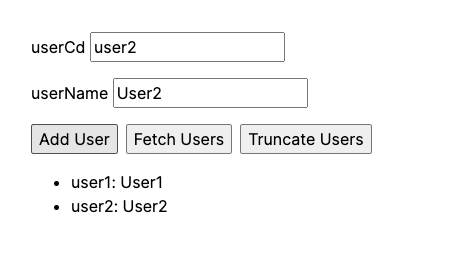

# js-wasm-sqlite



Use SQLite in browser with WebAssembly.
Based on [SQLite Wasm in the browser backed by the Origin Private File System](https://developer.chrome.com/blog/sqlite-wasm-in-the-browser-backed-by-the-origin-private-file-system/)

## Usage

```bash
pnpm install
pnpm dev
```
